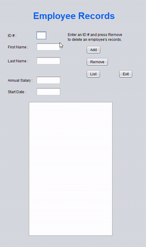

# Employee-Tracking-System
A tracking system to which you can add employees by their id#, name, salary, and start position. It also has the option to remove employees from the database.
It was created using java and the java.swing GUI interface. 

The project can be run on any java IDE.

If you want to see how the applictaion looks like and works, here is a GIF:

